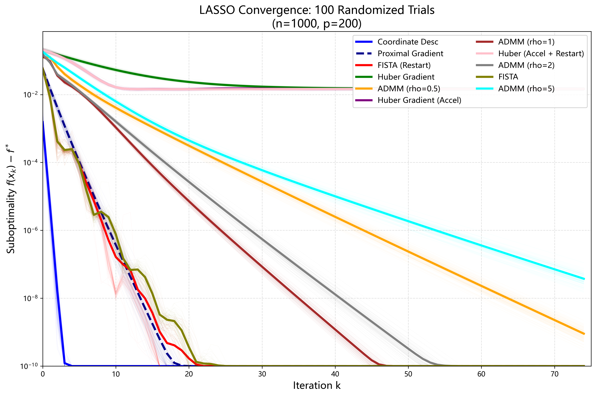
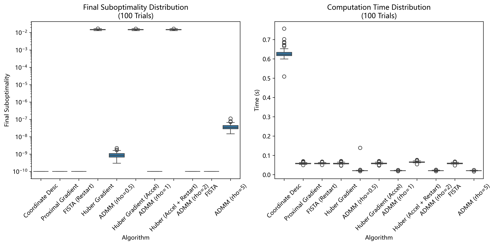
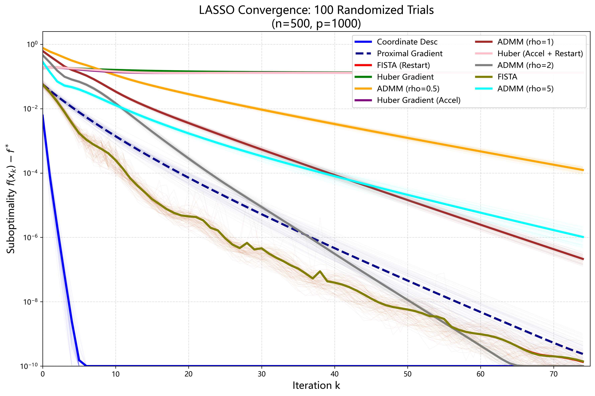
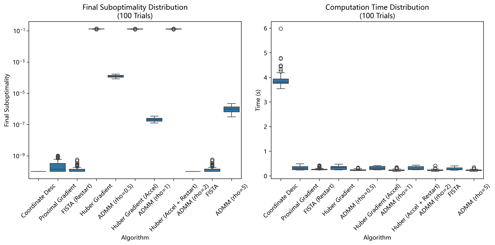

# 求解 Lasso 回归算法分析

## 一、引言

Lasso回归通过在损失函数中引入 L1 正则化项，能够实现特征选择和模型稀疏化，广泛应用于高维数据建模。本实验采用标准 Lasso 目标函数，数学形式为：

$$
\min_{\beta} \frac{1}{2n} \| X\beta - y\|_2^2 + \lambda \|\beta\|_1
$$

其中：
- $X \in \mathbb{R}^{n \times p}$ 为特征矩阵($n$ 为样本数, $p$ 为特征数）
- $y \in \mathbb{R}^n$ 为标签向量
- $\lambda > 0$ 为正则化参数（控制稀疏化程度）
- $\beta \in \mathbb{R}^p$ 为待估计的系数向量
- $\frac{1}{2n}$ 为残差平方和的归一化因子

由于 L1 正则化项的非光滑性，传统梯度下降法难以直接应用，本文旨在通过实验比较 5 类主流 Lasso 求解算法的性能，重点分析不同 $(n,p)$ 组合对算法计算效率和求解精度的影响，为算法选择提供参考。

---

## 二、实验设置

### 1. 测试算法

本次实验实现 5 类 11 种算法：

1. **最速坐标下降法**（Coordinate Desc）
2. **临近点梯度法**（Proximal Gradient, ISTA）
3. **标准 FISTA**、**带重启的 FISTA**（FISTA (Restart)）
4. **ADMM** ($\rho = 0.5, 1, 2, 5$）
5. **Huber 梯度法**、**加速 Huber 梯度法**、**带重启的加速 Huber 梯度法**

所有算法的迭代终止条件均为：达到最大迭代次数，未设置基于精度的终止条件，确保所有算法在相同迭代步数下进行公平比较。

### 2. 数据生成

- **真实系数向量 $\beta_{\text{true}}$**：稀疏度为 10%（即 $p \times 0.1$ 个非零元素），非零元素服从标准正态分布 $\mathcal{N}(0,1)$
- **特征矩阵 $X$**：每个元素独立服从标准正态分布 $\mathcal{N}(0,1)$，生成后对每列进行标准化处理
- **标签向量 $y$**: $y = X\beta_{\text{true}} + \epsilon$ ，其中噪声项 $\epsilon \sim \mathcal{N}(0,0.1^2)$
- **数据标准化**：特征矩阵 $X$ 和标签向量 $y$ 均进行标准化处理，确保数值稳定性

### 3. 实验参数

- **独立重复实验次数**: $n_{\text{trials}} = 100$
- **最大迭代次数**: $\max_{\text{iter}} = 75$
- **正则化参数**: $\lambda = 0.1$
- **Huber 平滑参数**: $\mu = 0.01$
- **ADMM 惩罚参数**:$\rho \in \{0.5, 1, 2, 5\}$
- **最优解参考**：使用 scikit-learn 库的 Lasso 实现（max_iter=10000，tol = $1 \times 10^{-8}$）计算最优目标值 $f^*$，作为次优性计算的基准

**维度组合选择**：

1. **低维场景**: $n=200$，$p=50$ ($p < n$，特征数远小于样本数，传统统计学习场景）
2. **中维场景**: $n=1000$，$p=200$ ($p < n$，样本数和特征数均较大，常规机器学习场景）
3. **高维场景**: $n=500$，$p=1000$ ($p > n$，特征数大于样本数，高维小样本场景，Lasso 的典型应用场景）

### 4. 评价指标

采用两个核心评价指标：

1. **最终次优性**: $f(\beta_k) - f^*$，其中 $f(\beta)$ 为目标函数值，反映算法在最大迭代步数下的求解精度
2. **计算时间**：单次实验的总运行时间（单位：秒），反映算法的计算效率

---

## 三、实验结果与分析

### 1. 低维场景($n = 200, p = 50$）

#### (1) 收敛性分析

 

收敛性分析如下：
- 除 Huber 类算法外，其余算法（坐标下降法、临近点梯度法、FISTA 系列、ADMM 系列）均能在 75 次迭代内收敛到最优解（次优性接近 $1 \times 10^{-10}$）
- ADMM 系列算法收敛速度最快，在 10 次迭代内即可达到最优解，且不同 $\rho$ 值的 ADMM 性能差异较小
- FISTA 系列和临近点梯度法收敛速度次之，约在 20-30 次迭代内收敛
- Huber 类算法收敛后存在固定次优性误差（约 $4.3 \times 10^{-3}$），这是由于 Huber 函数对 L1 正则项的平滑近似导致的，平滑误差无法通过增加迭代次数消除
- 坐标下降法收敛速度最慢，但最终能达到最优解

#### (2) 性能统计

 

**表 1：低维场景(200, 50) 算法性能统计**

| 算法名称 | 平均最终次优性 | 次优性标准差 | 平均计算时间（秒） | 时间标准差 | 中位数时间（秒） |
|----------|----------------|--------------|-------------------|------------|------------------|
| Coordinate Desc | $0.000000$ | $0.000000$ | $0.075320$ | $0.003216$ | $0.074994$ |
| Proximal Gradient (ISTA) | $0.000000$ | $0.000000$ | $0.005907$ | $0.000814$ | $0.005980$ |
| FISTA | $0.000000$ | $0.000000$ | $0.006008$ | $0.000535$ | $0.005981$ |
| FISTA (Restart) | $0.000000$ | $0.000000$ | $0.006054$ | $0.000456$ | $0.005981$ |
| ADMM ($\rho=0.5$) | $0.000000$ | $0.000000$ | $0.004614$ | $0.000594$ | $0.004853$ |
| ADMM ($\rho=1$) | $0.000000$ | $0.000000$ | $0.004492$ | $0.000558$ | $0.004179$ |
| ADMM ($\rho=2$) | $0.000000$ | $0.000000$ | $0.004580$ | $0.000649$ | $0.004427$ |
| ADMM ($\rho=5$) | $0.000000$ | $0.000000$ | $0.004570$ | $0.000795$ | $0.004317$ |
| Huber Gradient | $0.004300$ | $0.000448$ | $0.005785$ | $0.000683$ | $0.005980$ |
| Accelerated Huber Gradient | $0.004271$ | $0.000439$ | $0.006182$ | $0.000530$ | $0.005981$ |
| Restarted Accelerated Huber Gradient | $0.004264$ | $0.000436$ | $0.009425$ | $0.000633$ | $0.009282$ |

**表 2：低维场景下不同优化算法的性能对比结论**

| 评估指标 | 算法类别/名称 | 关键结论 |
|----------|--------------|----------|
| 求解精度 | 坐标下降法、临近点梯度法、FISTA 系列、ADMM 系列 | 均能达到最优解，平均次优性为 $0$ |
| | Huber 类算法（标准/带重启加速） | 存在固定次优性误差；带重启的加速 Huber 梯度法误差最小（$4.264 \times 10^{-3}$） |
| 计算速度 | ADMM 系列（$\rho=1$ 最优） | 速度最快，平均时间 $0.0045 \sim 0.0046$ 秒；ADMM（$\rho=1$）最快且稳定性最好 |
| | 临近点梯度法、FISTA 系列、标准 Huber 梯度法 | 速度相近，平均时间 $0.0058 \sim 0.0062$ 秒 |
| | 坐标下降法 | 速度最慢（$0.0753$ 秒），是最快算法的 $16.8$ 倍 |

---

## 2. 中维场景($n = 1000, p = 200$）

### (1) 收敛性分析

 

与低维场景相比，中维场景下样本数和特征数均增加，算法收敛性呈现以下特点：

- **ADMM系列算法**仍保持最优收敛速度，在15次迭代内达到最优解，且ρ=1,2,5的ADMM轨迹几乎重合，稳定性优于ρ=0.5
- **FISTA系列和临近点梯度法**收敛速度略有下降，需30-40次迭代达到最优解，这是由于特征数增加导致梯度计算量增大
- **坐标下降法**收敛速度进一步变慢，在75次迭代末期才接近最优解，表明其计算复杂度随特征数增长而显著增加
- **Huber类算法**的次优性误差约为1.47×10⁻²，比低维场景更大，说明平滑误差随维度增加而增大

### (2) 性能统计

 

**表3：中维场景(1000,200)算法性能统计**

| 算法名称 | 平均最终次优性 | 次优性标准差 | 平均计算时间（秒） | 时间标准差 | 中位数时间（秒） |
|----------|----------------|--------------|-------------------|------------|------------------|
| Coordinate Desc | 0.000000 | 0.000000 | 0.627417 | 0.024305 | 0.624170 |
| Proximal Gradient (ISTA) | 0.000000 | 0.000000 | 0.058369 | 0.003789 | 0.057144 |
| FISTA | 0.000000 | 0.000000 | 0.058433 | 0.003691 | 0.056870 |
| FISTA (Restart) | 0.000000 | 0.000000 | 0.058448 | 0.003822 | 0.057087 |
| ADMM (ρ=0.5) | 0.000000 | 0.000000 | 0.022106 | 0.011793 | 0.020929 |
| ADMM (ρ=1) | 0.000000 | 0.000000 | 0.020732 | 0.009965 | 0.020699 |
| ADMM (ρ=2) | 0.000000 | 0.000000 | 0.020922 | 0.001081 | 0.020907 |
| ADMM (ρ=5) | 0.000000 | 0.000000 | 0.020931 | 0.001108 | 0.020930 |
| Huber Gradient | 0.014771 | 0.000746 | 0.058274 | 0.004259 | 0.056604 |
| Accelerated Huber Gradient | 0.014741 | 0.000744 | 0.058511 | 0.004393 | 0.056736 |
| Restarted Accelerated Huber Gradient | 0.014730 | 0.000743 | 0.065575 | 0.004070 | 0.063825 |

**表4：中维场景下不同优化算法的性能对比结论**

| 评估指标 | 算法类别/名称 | 关键结论 |
|----------|--------------|----------|
| 求解精度 | 除Huber类算法外的其余算法 | 仍能达到最优解（平均次优性为0），表明中维场景下对标准Lasso目标函数的求解精度不受维度增加影响 |
| | Huber类算法 | 平均次优性为1.47×10⁻²，较低维场景增加约3.4倍，表明平滑误差随维度增加而显著增大 |
| 计算速度 | ADMM系列算法 | 仍为最快，平均时间0.0207～0.0221秒，较低维场景增加约4.6倍 |
| | FISTA系列、临近点梯度法、标准Huber梯度法 | 平均时间0.0583～0.0588秒，较低维场景增加约9.7倍 |
| | 坐标下降法 | 平均时间大幅增加至0.627秒，是低维场景的8.3倍，成为效率最低的算法 |
| | 带重启的加速Huber梯度法 | 平均时间0.0656秒，比标准Huber梯度法慢约12.5% |

---

## 3. 高维场景($n = 500, p = 1000$）

### (1) 收敛性分析

 

高维场景下特征数远超样本数，是Lasso的典型应用场景，算法收敛性呈现以下显著变化：

- **ADMM系列算法**（ρ=1,2,5）仍保持快速收敛，在20次迭代内达到最优解，表现出极强的高维适应性；ADMM（ρ=0.5）收敛速度略有下降，存在微小误差（1.24×10⁻⁴）
- **FISTA系列和临近点梯度法**收敛速度明显变慢，需50-60次迭代才能接近最优解，这是由于高维场景下梯度计算和临近算子更新的计算量显著增加
- **坐标下降法**在75次迭代内能达到最优解，但计算时间大幅增加
- **Huber类算法**的次优性误差进一步增大至0.130左右，比中维场景增加约8.8倍，表明高维场景下Huber平滑近似效果显著变差

### (2) 性能统计

 

**表5：高维场景(500,1000)算法性能统计**

| 算法名称 | 平均最终次优性 | 次优性标准差 | 平均计算时间（秒） | 时间标准差 | 中位数时间（秒） |
|----------|----------------|--------------|-------------------|------------|------------------|
| Coordinate Desc | 0.000000 | 0.000000 | 3.873766 | 0.299012 | 3.802919 |
| Proximal Gradient (ISTA) | 0.000000 | 0.000000 | 0.316093 | 0.068663 | 0.309821 |
| FISTA | 0.000000 | 0.000000 | 0.285012 | 0.056049 | 0.251152 |
| FISTA (Restart) | 0.000000 | 0.000000 | 0.274426 | 0.047796 | 0.250944 |
| ADMM (ρ=0.5) | 0.000124 | 0.000021 | 0.239832 | 0.028126 | 0.231424 |
| ADMM (ρ=1) | 0.000000 | 0.000000 | 0.231145 | 0.025824 | 0.229021 |
| ADMM (ρ=2) | 0.000000 | 0.000000 | 0.232157 | 0.028056 | 0.233003 |
| ADMM (ρ=5) | 0.000001 | 0.000000 | 0.228820 | 0.022029 | 0.231642 |
| Huber Gradient | 0.130926 | 0.002646 | 0.322368 | 0.067014 | 0.342691 |
| Accelerated Huber Gradient | 0.130514 | 0.002653 | 0.316376 | 0.062516 | 0.309687 |
| Restarted Accelerated Huber Gradient | 0.130436 | 0.002656 | 0.306154 | 0.065446 | 0.267207 |

**表6：高维场景下不同优化算法的性能对比结论**

| 评估指标 | 算法类别/名称 | 关键结论 |
|----------|--------------|----------|
| 求解精度 | ADMM系列(ρ=1,2)、FISTA系列、临近点梯度法、坐标下降法 | 仍能达到最优解（平均次优性为0），表现出良好的高维求解能力 |
| | ADMM (ρ=0.5) | 平均次优性为1.24×10⁻⁴，略高于其他ADMM变体，表明ρ选择对高维场景下的ADMM精度有轻微影响 |
| | ADMM (ρ=5) | 平均次优性为1×10⁻⁶，几乎达到最优解 |
| | Huber类算法 | 平均次优性大幅增加至0.130左右，是低维场景的30倍，高维场景下Huber平滑近似效果显著变差 |
| 计算速度 | ADMM系列算法 | 仍为最快，平均时间0.229～0.240秒，较中维场景增加约11倍，其中ADMM (ρ=5)最快（0.2288秒） |
| | FISTA系列 | 平均时间0.274～0.285秒，成为第二快的算法类别 |
| | Huber类算法、临近点梯度法 | 平均时间0.306～0.322秒，较中维场景增加约5.5倍 |
| | 坐标下降法 | 平均时间大幅增加至3.874秒，是ADMM (ρ=5)的16.9倍，虽然能达到最优解但效率极低 |

---

## 4. 跨场景综合对比

为更直观地比较各算法在不同维度场景下的性能变化，下表汇总了各算法在三种场景下的平均计算时间和精度等级（最优解：A；微小误差：B；固定误差：C）。

**表7：跨场景算法性能综合对比**

| 算法名称 | 低维(200,50) | 中维(1000,200) | 高维(500,1000) | 精度等级 | 速度排名(高维) | 综合排名 |
|----------|---------------|----------------|----------------|----------|----------------|----------|
| ADMM (ρ=5) | 0.004570秒/0 | 0.020931秒/0 | 0.228820秒/1×10⁻⁶ | A | 1 | 1 |
| ADMM (ρ=1) | 0.004492秒/0 | 0.020732秒/0 | 0.231145秒/0 | A | 2 | 2 |
| ADMM (ρ=2) | 0.004580秒/0 | 0.020922秒/0 | 0.232157秒/0 | A | 3 | 3 |
| ADMM (ρ=0.5) | 0.004614秒/0 | 0.022106秒/0 | 0.239832秒/1×10⁻⁴ | A/B | 4 | 4 |
| FISTA (Restart) | 0.006054秒/0 | 0.058488秒/0 | 0.274426秒/0 | A | 5 | 5 |
| FISTA | 0.006008秒/0 | 0.058433秒/0 | 0.285012秒/0 | A | 6 | 6 |
| Proximal Gradient (ISTA) | 0.005907秒/0 | 0.058369秒/0 | 0.316093秒/0 | A | 7 | 7 |
| Restarted Accelerated Huber Gradient | 0.009425秒/4.264×10⁻³ | 0.065575秒/1.473×10⁻² | 0.306154秒/0.130436 | C | 8 | 8 |
| Accelerated Huber Gradient | 0.006182秒/4.271×10⁻³ | 0.058511秒/1.474×10⁻² | 0.316376秒/0.130514 | C | 9 | 9 |
| Huber Gradient | 0.005785秒/4.300×10⁻³ | 0.058274秒/1.477×10⁻² | 0.322368秒/0.130926 | C | 10 | 10 |
| Coordinate Desc | 0.075320秒/0 | 0.627417秒/0 | 3.873766秒/0 | A | 11 | 11 |

> **注**：表格中数值格式为「计算时间/最终次优性」；精度等级 A：达到最优解；B：微小误差 (<1×10⁻⁴)；C：显著误差 (>1×10⁻²)；所有指标基于标准Lasso目标函数

### (1) 算法性能排名（综合精度和速度）

#### 1. 第一梯队：ADMM系列（ρ=1,2,5）
- **精度**：所有场景下均达到最优解（等级A）
- **速度**：三种场景下均为最快，且时间增长相对平缓
- **适应性**：对低维、中维、高维场景均表现稳定，尤其是ρ=5的ADMM在高维场景下性能最优

#### 2. 第二梯队：FISTA系列
- **精度**：所有场景下均达到最优解（等级A）
- **速度**：中低维场景下为中等速度，高维场景下为第二快
- **适应性**：适合各类维度场景，是高维场景下ADMM的良好替代

#### 3. 第三梯队：临近点梯度法
- **精度**：所有场景下达到最优解（等级A）
- **速度**：中低维场景下为中等速度，高维场景下速度下降明显
- **适应性**：适合中低维场景，高维场景下性能不及ADMM和FISTA

#### 4. 第四梯队：Huber类算法
- **精度**：存在显著次优性误差（等级C），且误差随维度增加而急剧增大
- **速度**：中低维场景下为中等速度，高维场景下速度一般
- **适应性**：仅在对精度要求极低的特殊场景下考虑

#### 5. 第五梯队：坐标下降法
- **精度**：所有场景下均能达到最优解（等级A）
- **速度**：所有场景下均最慢，且高维场景下时间大幅增加
- **适应性**：仅适合低维小样本场景，高维场景下完全不推荐

### (2) 维度变化对算法的影响
- **对ADMM系列**：时间随维度增长呈线性增长，精度保持稳定，受影响最小
- **对FISTA系列**：时间增长较快但精度保持稳定，高维适应性良好
- **对临近点梯度法**：时间增长明显，但精度保持稳定
- **对Huber类算法**：精度随维度增加急剧恶化，时间增长相对平缓
- **对坐标下降法**：影响最大，时间呈指数级增长
---
## 四、结论与建议

### 1. 实验结论

通过对三种维度场景的 $100$ 次独立实验，得出以下结论：

- **ADMM 系列算法**（尤其是 $\rho = 1, 2, 5$）在所有维度场景下均表现最优，兼顾求解精度（达到最优解）和计算效率（最快速度），且对维度变化的适应性最强，是标准 Lasso 回归的首选算法
- **FISTA 系列算法**在所有场景下均能达到最优解，高维场景下速度仅次于 ADMM，是实现相对简单且性能稳定的替代选择
- **临近点梯度法**在中低维场景下性能稳定，精度达到最优解，但在高维场景下速度下降明显
- **Huber 类算法**求解速度中等，但存在显著次优性误差，且误差随维度增加急剧增大，不适合精度要求较高的场景
- **坐标下降法**在所有场景下虽能达到最优解，但计算效率极低，且在高维场景下时间成本不可接受，不推荐用于实际应用
- **维度变化对不同算法的影响差异显著**：ADMM 系列受影响最小，坐标下降法受影响最大，Huber 类算法在精度上受维度影响最大

### 2. 应用建议

- **高维小样本场景($p > n$)**：优先选择 ADMM($\rho=5$ 或 $\rho=1$)，兼顾精度和速度；FISTA 系列是良好的备选方案
- **中维场景($p < n$ 且样本数较大）**：ADMM 系列仍为最优选择；FISTA 系列和临近点梯度法也是良好选择
- **低维场景($p < n$ 且样本数较小）**：ADMM 系列（追求速度）或 FISTA 系列（追求实现简单）都是良好选择
- **算法参数选择**：ADMM 的惩罚参数 $\rho$ 建议选择 $1 \sim 5$，Huber 平滑参数 $\mu$ 需要根据维度调整，高维场景下可能需要更小的 $\mu$ 值

---
